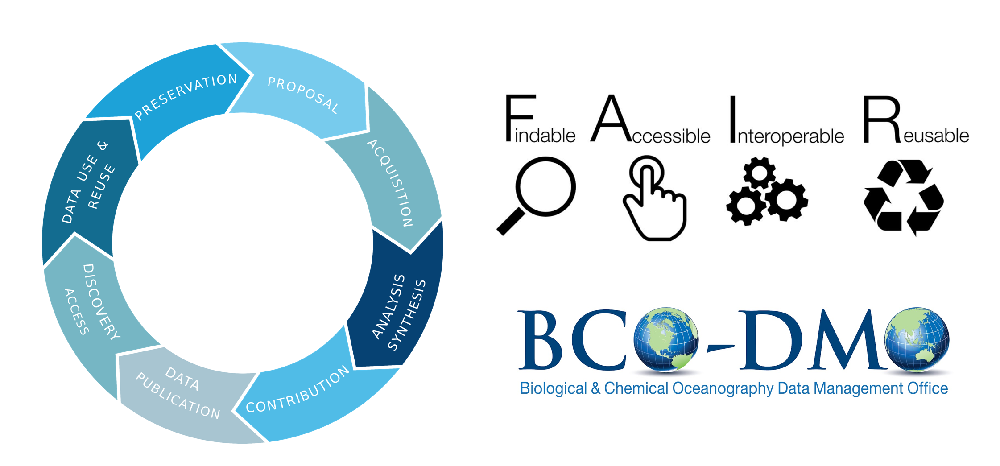

## Deep Dive into Data Management

So far we have tackled the general concepts around data management: F.A.I.R concepts and the data life cycle. And where BCO-DMO fits in that picture. 

Today we will dive deeper into practical data management and teach skills that can be applied to real-life datasets. 

### Part 1: Good approaches to Tabular Data Formatting

After this lesson, you will be able to:
- Implement best practices in data table formatting  
- Identify and address common formatting mistakes
- Understand approaches for handling dates in spreadsheets
- Utilize basic quality control features and data manipulation practices
- Effectively export data from spreadsheet programs

Spreadsheets are good for data entry. Therefore we have a lot of data in spreadsheets. 
Much of your time as a researcher will be spent in this 'data wrangling' stage. It's not the most fun, but it's necessary. We'll teach you how to think about data organization and some practices for more effective data wrangling.

### Part 2: Manipulation of F.A.I.R datasets

After this lesson, you will be able to:

- Apply best practices in data table formatting we learned in previous lessons
- Utilize basic quality control features and data manipulation practices
- Perform basic statistical analyses and plotting.
- Effectively export data from spreadsheet programs
- Learn the benefits and drawbacks to analyzing data in spreadsheets.
- Learn about other ways to analyze data other than spreadsheets.

### Content

1. Tabular Data and Spreadsheets
2. Dates
3. Exercise "Be a Data Manager"
4. Exporting Data
5. Assessing metadata
6. Download data
7. Data manipulation in spreadsheets
8. What is Next? 
