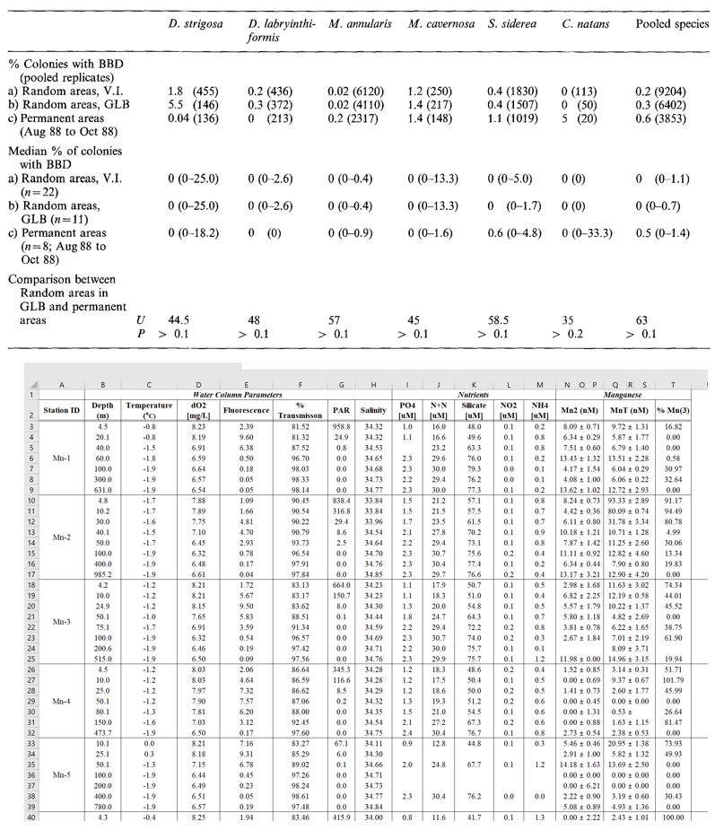

### Data organization and the data life cycle

Good data organization is the foundation of your research project and should already be taken into account in the acquisition phase of a research project. 

The structure and format of datasets can be planned and described in the proposal stage of a research project and is captured in a document called the **data management plan** (DMP).

A data management plan (DMP) is a written document that describes the  data you expect to acquire/generate during the course of a research  project, how you will manage, describe, analyze, and store those data, and what mechanisms you will use at the end of your project to share and preserve your data.

Important to note that this is a living document and can be adjusted as you move forward. But it helps as a framework at the start. 

### Spreadsheets for Data Entry

Most researchers have data or do **data entry** in spreadsheets. Spreadsheet programs are very useful **graphical interfaces** for designing data tables and handling basic data quality control. 

Many spreadsheet programs are available. Since most participants utilize Excel as their primary spreadsheet program, this lesson will make use of Excel examples.

NOTE: Excel is **proprietary software**, which means that it is owned by a company that is restricting the ways it can be used. A free spreadsheet program that can also be used is LibreOffice. Commands may differ a bit between programs, but the general idea is the same.

> ## Exercise
> - How many people have used spreadsheets in their class?
> - How many people have accidentally done something that made them frustrated or sad?
> {: .callout}

Spreadsheets encompass a lot of the things we need to be able to do as researchers. We can use them for:

- Data entry
- Organizing data
- Subsetting and sorting data
- Statistics
- Plotting

> ## Exercise
> - What kind of operations do you do in spreadsheets?
> - Which ones do you think spreadsheets are good for?
> {: .callout}

## Problems with Spreadsheets

Spreadsheets are good for **data entry**, but in reality we tend to use spreadsheet programs for much more than data entry. We use them to create data tables for publications, to generate summary statistics, and make figures.

Generating **tables for publications** in a spreadsheet is not optimal - often, when formatting a data table for publication, we’re reporting key summary statistics in a way that is **not really meant to be read as data**, and often involves special formatting (merging cells, creating borders, making it pretty). 

The latter two applications, **generating statistics and figures**, should be used with caution: because of the graphical, drag and drop nature of spreadsheet programs, it can be very difficult, if not impossible, to **replicate your steps** (much less retrace anyone else's), particularly if your stats or figures require you to do more complex calculations. 

Furthermore, in doing calculations in a spreadsheet, it’s easy to accidentally apply a slightly different formula to multiple adjacent cells. When using a  command-line based statistics program like R or SAS, it’s practically impossible to apply a calculation to one observation in your  dataset but not another unless you’re doing it on purpose. 

However, there are circumstances where you might want to use a spreadsheet program to produce “quick and dirty” calculations or figures, and data cleaning will help you use some of these features. Data cleaning also puts your data in a better format prior to importation into a statistical analysis program. 

### Not all data is tabular

The focus of this class is tabular data. However, it is important to note that there are other data types out there such as documents, experimental data, fasta files, spectral counts, code, images, maps. 

