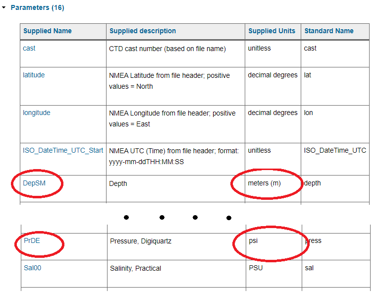
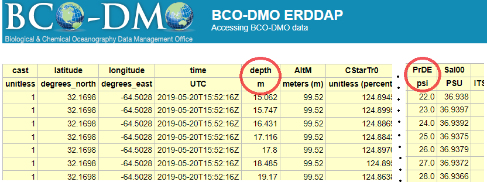

### Assessing a Dataset

Let's take a look at an example Dataset Metadata Page at BCO-DMO. 

**Dataset: AE1910 CTD Profiles**: [https://www.bco-dmo.org/dataset/774958](https://www.bco-dmo.org/dataset/774958)

## Reviewing the metadata

Does the metadata include important context for using these data?  Does it indicate anything about the data quality? Is it preliminary or final?

Can you find information about what is in each data column?  What are the units?

> ## Exercise: Finding units
>
> Go to **Dataset: AE1910 CTD Profiles**: [https://www.bco-dmo.org/dataset/774958](https://www.bco-dmo.org/dataset/774958) which serves a data table.  
>
> Can you find which column(s) contain information about how deep the measurements were taken?
>
> What are the column(s) names?  
> 
> What are the units?
>
> > ## Solution
> > In the section called** "Parameters" **has this information.
> >
> > 
> > 
> > You can also see this information by viewing the data table with the  button.  However since you don't have descriptions of the columns here, it is best to get the information from the "Parameters" section as shown above.
> > 
> > 
> > 
> > {: .output}
> {: .solution}
{: .challenge}

## Downloading a Dataset

Instead of using the erddap server, you can download a whole dataset from the BCO-DMO landing page itself. There are buttons to easily download data in many file formats.

